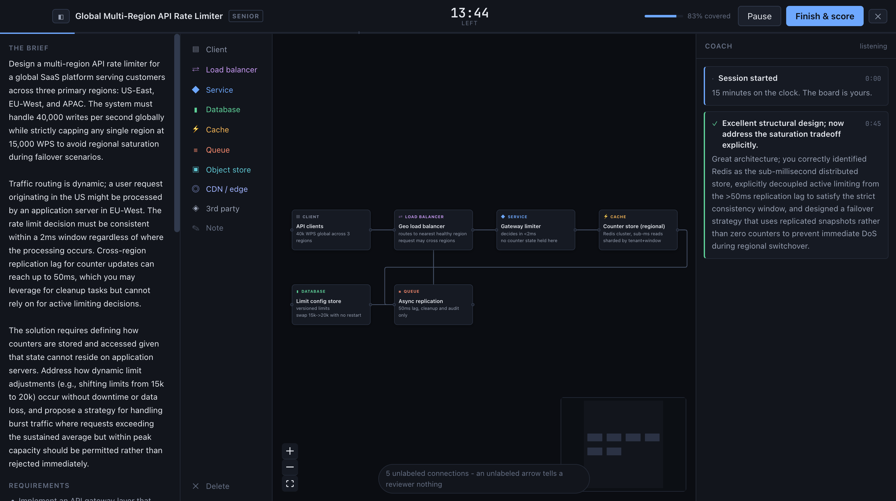
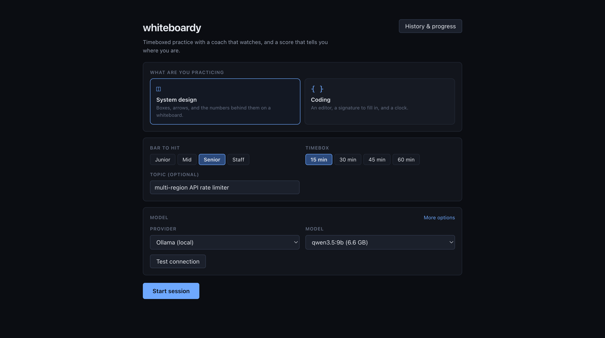
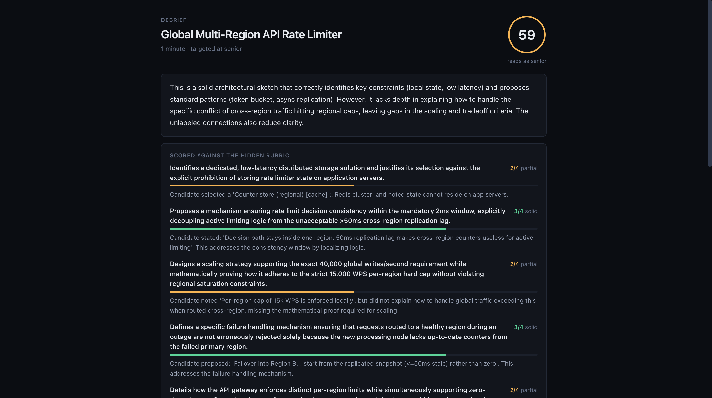
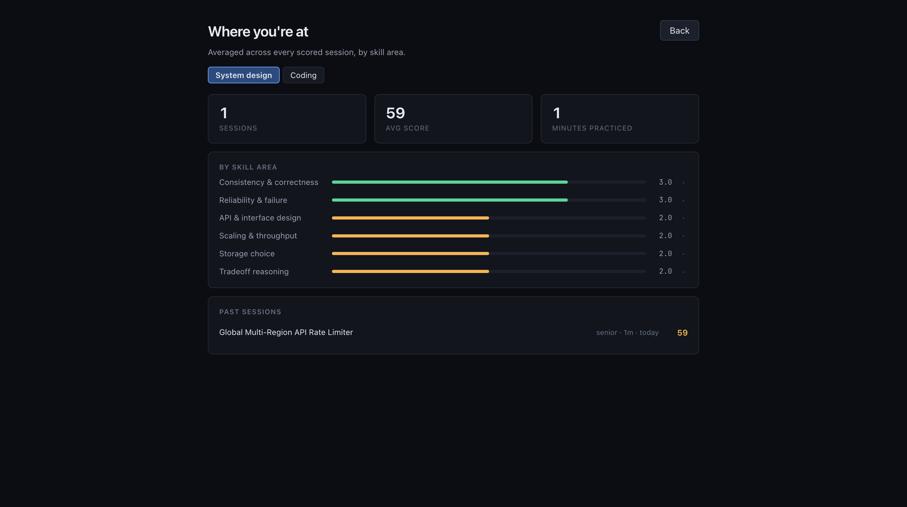

<p align="center">
  <h1 align="center">whiteboardy</h1>
  <p align="center">
    Timeboxed system design and coding practice, with a coach that watches you work.
    <br /><br />
    <a href="https://github.com/urmzd/whiteboardy/releases">Download</a>
    &middot;
    <a href="https://github.com/urmzd/whiteboardy/issues">Report Bug</a>
    &middot;
    <a href="https://github.com/urmzd/whiteboardy/discussions">Discussions</a>
  </p>
</p>

<p align="center">
  <a href="https://github.com/urmzd/whiteboardy/actions/workflows/release.yml"></a>
  &nbsp;
  <a href="LICENSE"></a>
</p>

<p align="center">
  
</p>

> [!WARNING]
> **Beta, and still in testing.** The harness works end to end, but prompts, scoring
> calibration, and the session format are all still moving. Scores are directional, not
> authoritative. Expect rough edges and breaking changes to the saved-session format.

A native desktop app that generates a practice exercise, times you, interrupts when it is
worth interrupting, and scores what you actually produced against a rubric written before
you started. Runs fully local against [Ollama](https://ollama.com), or against a hosted
model if you would rather.

Practice tools tend to hand you a problem and a solution. The gap between "I read the
answer and it made sense" and "I can produce that under a clock" is the thing that
actually needs training, and nothing closes it for you.

## Features

- **A clock that matters.** Every exercise is scoped to the timebox, and pacing nudges
  fire on arithmetic, not vibes.
- **A coach that mostly stays quiet.** It speaks when you are about to build on a bad
  assumption, when a high-weight area is running out of time, or when a choice is worth
  questioning. Silence is the default, because interrupting someone mid-thought is worse
  than saying nothing.
- **A hidden rubric.** Written at generation time, revealed only in the debrief, so you
  cannot teach to the test.
- **Curveballs.** Partway through, a requirement changes, the way it does when an
  interviewer notices you look comfortable.
- **A profile that accumulates.** Rubric criteria map onto a fixed skill taxonomy, so
  scores compare across sessions. That is the part that tells you where you actually are.
- **Two modes.** A board of labeled components and annotated connections for system
  design; an editor seeded with a signature and a worked example for coding.

The board is a node graph rather than a freehand canvas on purpose: the coach reads your
components, connections, and annotations as structure, which is what makes real critique
possible instead of pattern-matching on pixels.

## Installation

### Prerequisites

| Requirement | Version |
|-------------|---------|
| Go | 1.25+ |
| Node | 22+ |
| Wails | v2.11 |
| Ollama | any recent, with a model pulled |

### Build

```sh
git clone https://github.com/urmzd/whiteboardy
cd whiteboardy
make init
make build
```

The app lands in `build/bin/`. For a live-reloading dev loop, use `make dev`.

Pre-built binaries land on the [releases page](https://github.com/urmzd/whiteboardy/releases)
once tagged.

## Quick Start

```sh
ollama pull qwen3.5:9b
make build && open build/bin/whiteboardy.app
```

1. Pick a provider and model on the setup screen, then hit **Test connection**.
2. Choose a mode, a level, and a timebox. Start. Generation takes a moment on a local
   model: it writes the brief, then the hidden rubric.
3. Work. The coach reads your board or code on an interval and speaks only when it has
   something worth saying.
4. Hit **Finish & score** for the debrief, then check **Progress** once you have a few
   sessions behind you.

Anything in the 7-9B range and up is usable. Smaller models produce noticeably thinner
rubrics. Sessions are written to `~/.whiteboardy/sessions` as plain JSON, and nothing
leaves your machine unless you point it at a hosted provider.

<p align="center">
   &nbsp;  &nbsp; 
</p>
<p align="center"><em>Setup &middot; Debrief &middot; Progress</em></p>

Every criterion is scored 0-4 with the evidence that earned it, quoted from your board and
your notes. The overall number is computed from those scores and their weights, so it
cannot drift from the reasoning behind it. Ranking an area as a strength or a weakness is
withheld until it has at least two samples, and trend needs three, because calling
something a weakness off one data point is noise dressed as insight.

## Configuration

Settings live in `~/.whiteboardy/settings.json` and are editable from the setup screen.

| Provider | Model discovery | Notes |
|----------|-----------------|-------|
| Ollama | Automatic | Default. Fully local, no key. |
| Anthropic | Manual model id | Needs an API key |
| OpenAI | Manual model id | Needs an API key |
| Google | Manual model id | Needs an API key |

Provider plumbing comes from [saige](https://github.com/urmzd/saige)'s agent SDK.

## Architecture

The backend drives the UI over an [AG-UI](https://github.com/ag-ui-protocol/ag-ui)-shaped
event stream: a run is bracketed by `RUN_STARTED` and `RUN_FINISHED`, agent speech arrives
as `TEXT_MESSAGE_START` / `CONTENT` / `END`, and shared state moves as `STATE_SNAPSHOT`
plus `STATE_DELTA`. The frontend is a pure reduction of that stream and never polls, so
the agent decides when to respond rather than the UI asking.

See [docs/architecture.md](docs/architecture.md) for the full guide, including why problem
generation and each coaching tick are two LLM calls rather than one.

## Development

```sh
make check   # fmt, vet, lint, test, typecheck
make test    # Go tests only
make live    # exercise the harness against a real model (needs ollama)
make record  # recapture the reproducible showcase screens
```

`make live` is how prompt changes get validated. It asserts the things that actually
matter: that generated rubrics map onto the taxonomy, that curveballs exist, that the
coach streams rather than emitting one blob, and that near-empty work does not score well.
Override the model with `make live MODEL=qwen3.5:2b`.

See [CONTRIBUTING.md](CONTRIBUTING.md) for the full workflow.

## Known Gaps

This is where the beta label comes from.

- Scoring calibration is unvalidated across models. A 3B model and a 9B model do not grade
  the same work the same way, and neither has been checked against human judgment.
- Coach silence is a soft bias, not a guarantee. It sometimes speaks earlier than it
  should.
- Coding mode is exercised by the live tests but has not been driven end to end through
  the app the way system design has.
- The saved-session format is not stable yet, so old sessions may stop aggregating.
- No import, export, or replay of sessions.
- Coding mode has no execution and no test runner. Correctness is judged by reading.

## License

[Apache-2.0](LICENSE)
